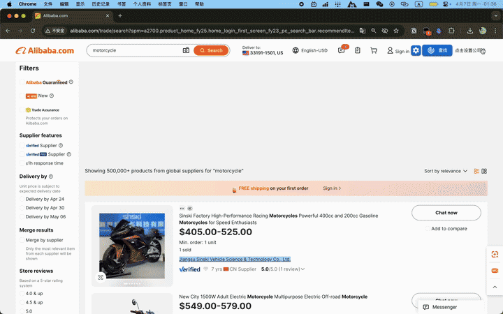

## 描述

一个油猴 (Tampermonkey)脚本，利用vite-plugin-monkey工程化脚本开发，使用Quasar编写UI。
功能：在阿里巴巴国际站(https://www.alibaba.com/) 搜索页结果中自动定位设定公司的产品，并自动复制产品ID、产品链接、自然排名、所在页数等数据以方便在excel中粘贴，脚本目的在于让运营人员统计并排查本公司产品链接在系统中搜索结果的权重表现。

## 演示

